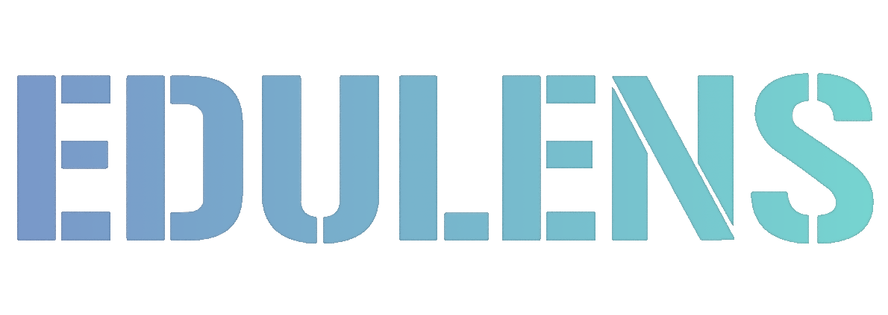

  <a href="README.md">中文</a> | <a href="docs/README.en.md">English</a>

  
  

## 📖 项目概览

EduLens 是一款开源的 Chrome 浏览器插件，聚焦网页高效学习与实时协作。

无需切换应用，即可在页面内完成笔记、截图、聚焦阅读与课堂演示。

- **项目介绍 官网**：<https://edu-lens.netlify.app/>          $\leftarrow$ 🥰点我查看项目概况
- **Chrome 商店**：<https://chromewebstore.google.com/detail/jnncboomobahpjpkkhjoekacjogmphhc>

---

## ✨ 核心特点

- 👥 **实时协作** - 多人房间系统，支持实时同步标注
- 💾 **双端同步** - 标注数据自动保存到本地和云端
- 🎨 **丰富的标注工具** - 涂鸦绘制、框选批注、书签、图片等多种标注方式
- 📸 **强大的截图功能** - DOM 截图、区域截图、长屏滚动截图
- 🎯 **阅读辅助** - 聚光灯(`Alt+S`)、阅读聚焦(`Alt+R`)、鼠标高亮(`Alt+H`)、倒计时等专注工具
- 🌍 **国际化支持** - 内置中文简繁体、英文、日语、德语、西班牙语多种语言

## 🎯 适用场景

- **个人学习** - 网页学习时 记录笔记、标记重点、专注阅读
- **在线教学** - 在线远程授课时 实时多人标注、演示和互动
- **视频制作** - 录制教学视频时 添加可视化标注

---

## 🛠️ 开发者指南

### 环境要求

- Node.js ≥16，npm ≥8

### 插件（extension/）

- 安装：`npm install`
- 开发：`npm run dev`（生成开发构建并监听变更），在 `chrome://extensions` 选择 `extension/dist` 载入
- 打包：`npm run build`
- 结构：入口/源码位于 `extension/src`，输出在 `extension/dist`

### 后端（server/）

- 安装：`npm install`
- 本地开发：`NODE_ENV=development npm run dev`
- 生产：`NODE_ENV=production npm start`
- 依赖 MongoDB 和 WebSocket；需要的环境变量（按 `NODE_ENV` 读取 `.env.<env>`）：
  - `MONGODB_URI`：MongoDB 连接串
  - `JWT_SECRET`：JWT 密钥
  - `JWT_EXPIRES_IN`：令牌有效期（如 `7d`）
  - `PORT`（可选，默认 3000）

### 官网（website/）

- 基于 Vite + Vue 3：`npm install && npm run dev`；生产构建 `npm run build`
- 可部署到任意静态托管，产物位于 `website/dist`

---

## 🤝 反馈与贡献

- 问题反馈：<https://github.com/organic-waste/edulens/issues>
- 邮箱：o.organic.waste.o@gmail.com / 1473980832@qq.com
