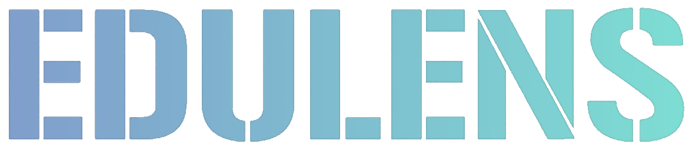

  <a href="README.md">中文</a> | <a href="docs/README.en.md">English</a>

  
  

## 📖 项目简介

EduLens 是一款专为 个人学习 和 在线教学 设计的浏览器扩展插件。

提供实时协作标注、丰富笔记工具及阅读辅助功能，既可用于学习者高效整理知识，也可助力教学课堂互动体验。

### 核心特点

- 👥 **实时协作** - 多人房间系统，支持实时同步标注
- 💾 **云端同步** - 标注数据自动保存到本地和云端
- 🎨 **丰富的标注工具** - 涂鸦绘制、框选批注、书签、图片等多种标注方式
- 📸 **强大的截图功能** - DOM 截图、区域截图、长屏滚动截图
- 🎯 **阅读辅助** - 聚光灯、鼠标高亮、倒计时等专注工具
- 🌍 **国际化支持** - 内置中文简繁体、英文、日语、德语、西班牙语多种语言

### 应用场景

- **个人学习** - 在网页学习时记录笔记、标记重点、专注阅读
- **在线教学** - 在线远程授课时进行实时多人标注、演示和互动
- **视频制作** - 录制教学视频时添加可视化标注

---

## 📝 使用指南

启动插件后，面板气泡会出现在网页右下角，可拖拽调整位置，点击即可展开工具面板。

#### 学习工具

- **滚动进度条** - 工具面板左侧竖轴实时显示阅读进度
- **书签功能** - 在需要标记的位置输入标题并添加书签；点击竖轴处的圆点书签即可快速跳转
- **倒计时器** - 输入分钟数后开始倒计时，结束时弹出提醒

#### 标注工具

- **涂鸦绘制** - 点击“涂鸦”功能，选择颜色和笔刷大小即可绘制，支持直线、橡皮擦和一键清除
- **框选批注** - 选择“框选批注”后在页面拖拽矩形框并输入内容，悬停可查看完整批注
- **图片挂起** - 点击“图片”上传本地图片，可拖拽调整位置、大小和旋转，支持固定或随页面滚动

#### 截图工具

- **DOM 截图** - 点击后悬停页面元素即可高亮，单击完成截图
- **区域截图** - 在页面拖拽绘制矩形区域，松开鼠标即可截图
- **滚动截屏** - 自动滚动页面并拼接长图，点击任意位置可提前结束

#### 专注工具

- **鼠标高亮** - 快捷键 `Alt+H`，突出鼠标周围区域
- **聚光灯** - 快捷键 `Alt+S`，高亮中心区域并暗化背景
- **阅读聚光灯** - 快捷键 `Alt+R`，聚焦当前阅读位置

#### 协作功能

> ⚠️ 协作功能需要连接服务器，未连接时会自动切换为本地模式（数据保存于 Chrome 本地）

- **登录注册** - 点击“登录”或“注册”，填写用户名、邮箱和密码（至少 6 个字符），注册成功后自动登录
- **创建房间** - 登录后在“房间列表”中点击“创建新房间”，填写名称与描述
- **分享房间** - 在“房间列表”中点击“分享”复制分享码给其他成员
- **加入房间** - 点击“加入新房间”，输入分享码即可加入
- **切换房间** - 在房间列表中点击“切换”即可跳转
- **实时同步** - 同房间用户访问同一网页时，书签、涂鸦、框选批注与图片等操作实时同步

---

## 📮 联系方式

- **邮箱**: 1473980832@qq.com / o.organic.waste.o@gmail.com
- **问题反馈**: [https://github.com/organic-waste/edulens/issues](https://github.com/organic-waste/edulens/issues)
